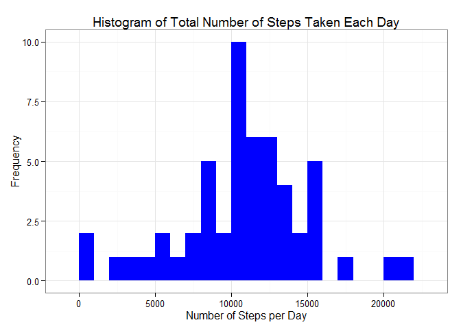
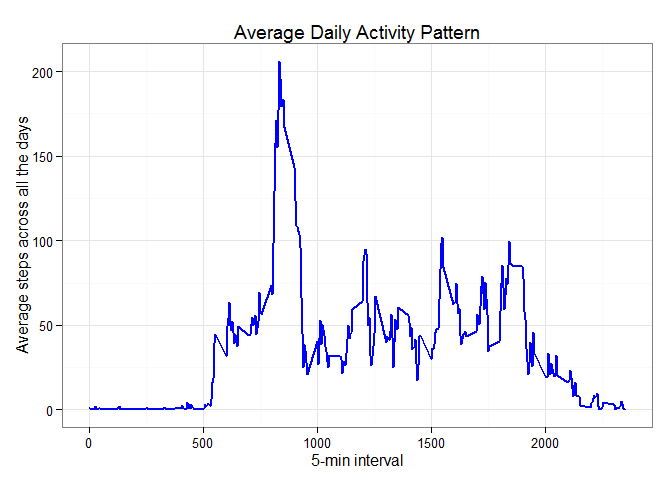
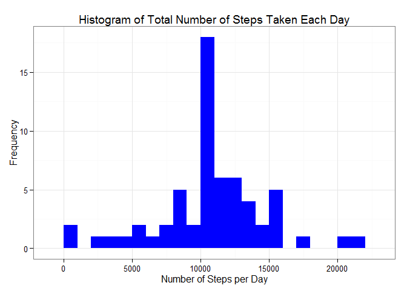
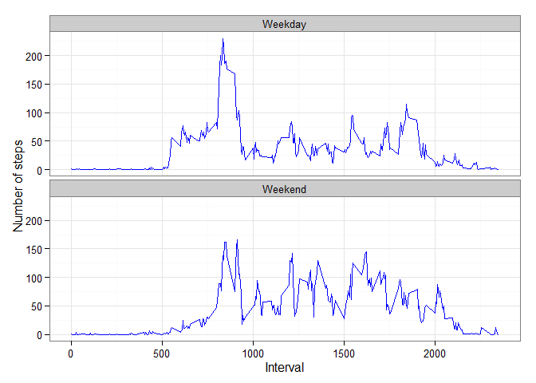

# Reproducible Research: Peer Assessment 1

Created by C.O.      Date: 2015-06-14

## Purpose of This Assignment

The purpose of this assignment is to use a single R markdown document that can be processed by knitr and be transformed into an HTML file.  

## Loading and preprocessing the data

First of all, it is necessary to set up working directory before R programming.

```r
setwd("/Users/Michael/Desktop/Codes/RepData_PeerAssessment1")
```

And then, to load necessary libraries and set up global environmental variables.


```r
library(knitr)  ## for Markdown
library(ggplot2)  ## for plotting

opts_chunk$set(echo = TRUE, results = 'hold') ##global environmental variables
```
After that, unzip the data file and read the data using read.csv().

```r
unzip("activity.zip") ##unzip data file
## Read data file after unzip
activity <- read.csv("activity.csv", header = TRUE, sep = ",", colClasses = c("numeric", "character", "numeric"))

activity$date <- as.Date(activity$date, format = "%Y-%m-%d")
activity$interval <- as.factor(activity$interval)
```
Show and check the data.

```r
str(activity)
```

```
## 'data.frame':	17568 obs. of  3 variables:
##  $ steps   : num  NA NA NA NA NA NA NA NA NA NA ...
##  $ date    : Date, format: "2012-10-01" "2012-10-01" ...
##  $ interval: Factor w/ 288 levels "0","5","10","15",..: 1 2 3 4 5 6 7 8 9 10 ...
```

## What is mean total number of steps taken per day?

Aggregate the data and remove NA data.


```r
Steps_Day <- aggregate(steps ~ date, data = activity, sum, na.rm = TRUE) ## remove NA data
#str(Steps_Day)
```

Plot the data and obtain histogram graph.


```r
ggplot(Steps_Day, aes(x = steps)) + 
                geom_histogram(fill = "blue", binwidth = 1000) + 
                labs(title="Histogram of Total Number of Steps Taken Each Day", x = "Number of Steps per Day", y = "Frequency") + theme_bw() 
```

 

Obtain the mean and median of total number of steps taken per day:


```r
mean(Steps_Day$steps, na.rm=TRUE)            
median(Steps_Day$steps, na.rm=TRUE)    
```

```
## [1] 10766.19
## [1] 10765
```

The mean is 10766.19 and the median is 10765.

## What is the average daily activity pattern?

Calculate the aggregation of steps by intervals of 5-minutes and assign the column names; 


```r
#head(activity)
Steps_Interval <- aggregate(activity$steps, by = list(interval = activity$interval), FUN=mean, na.rm=TRUE)
colnames(Steps_Interval) <- c("interval", "steps")
```

Transfer the interval column values into integer;


```r
Steps_Interval$interval <- 
        as.integer(levels(Steps_Interval$interval)[Steps_Interval$interval])      
#str(Steps_Interval)
#head(Steps_Interval)
```

Make a time series plot (i.e. type = "l") of the 5-minute interval (x-axis) and the average number of steps taken, averaged across all days (y-axis) as below:


```r
p<- ggplot(Steps_Interval, aes(x=interval, y=steps)) +   
        geom_line(color="blue", size=1 ) +  
        labs(title="Average Daily Activity Pattern", 
             x="5-min interval", 
             y="Average steps across all the days") +  theme_bw()

p
```

 

Obtain the maximum number of steps as below:
 

```r
max_int <- Steps_Interval[which.max(Steps_Interval$steps),]
max_int
```

```
##     interval    steps
## 104      835 206.1698
```

Therefore, the maximum number of steps is 206.1698 and the corresponding interval value is 835.

## Imputing missing values

Note that there are a number of days/intervals where there are missing values (coded as NA). The presence of missing days may introduce bias into some calculations or summaries of the data.

####1.Calculate and report the total number of missing values in the dataset (i.e. the total number of rows with NAs)

Obtain the missing data number.


```r
missing_data <- sum(is.na(activity$steps))
missing_data 
```

```
## [1] 2304
```

The total number of missing data are 2304.

####2.Devise a strategy for filling in all of the missing values in the dataset. The strategy does not need to be sophisticated. For example, you could use the mean/median for that day, or the mean for that 5-minute interval, etc.

The strategy is to use the mean for that 5-minute interval to fill each NA value in the steps column.

####3.Create a new dataset that is equal to the original dataset but with the missing data filled in.

Create the new dataset which are filled in the missing data by the mean for that 5-minute interval values.


```r
newdata <- activity 
for (i in 1:nrow(newdata)) {
    temp <- newdata[i, ]
    if (is.na(temp$steps)) {
        newdata$steps[i] <- subset(Steps_Interval, interval == temp$interval)$steps
    } 
    
}
```

Check the total number of missing data.


```r
sum(is.na(newdata$steps))
#head(newdata)
#str(newdata)
```

```
## [1] 0
```

The value of missing data is zero. It means that all missing data were filled.

####4.Make a histogram of the total number of steps taken each day and Calculate and report the mean and median total number of steps taken per day. Do these values differ from the estimates from the first part of the assignment? What is the impact of imputing missing data on the estimates of the total daily number of steps?

Aggregate the new data which were filled in missing data.


```r
Data_Day <- aggregate(steps ~ date, data = newdata, sum, na.rm = TRUE) 
```

Plot the histogram of the new data.


```r
ggplot(Data_Day, aes(x = steps)) + 
                geom_histogram(fill = "blue", binwidth = 1000) + 
                labs(title="Histogram of Total Number of Steps Taken Each Day", x = "Number of Steps per Day", 
                     y = "Frequency") + theme_bw() 
```

 

Obtain the mean and median of new data.


```r
mean(Data_Day$steps, na.rm=TRUE)  
median(Data_Day$steps, na.rm=TRUE)    
```

```
## [1] 10766.19
## [1] 10766.19
```

Finally, we can know that both mean and median values after filled in missing data are 10766.19 while the mean and median values before filled in missing data are 10766.19 and 10765, respectively.


## Are there differences in activity patterns between weekdays and weekends?


For this part the weekdays() function may be of some help here. Use the dataset with the filled-in missing values for this part.

####1. Create a new factor variable in the dataset with two levels -- "weekday" and "weekend" indicating whether a given date is a weekday or weekend day.

Create new factor variables of "weekday" and "weekend".


```r
wday <- weekdays(newdata$date)
wdayfactor <- vector()
for (i in 1:nrow(newdata)) {
    if (wday[i] == "Saturday" | wday[i] == "Sunday" ) {
        wdayfactor[i] <- "Weekend"    
    } else {
        wdayfactor[i] <- "Weekday"
    }
}
newdata$weekday <- wdayfactor
newdata$weekday  <- factor(newdata$weekday)
```

Aggregate the factors into the data.


```r
#str(newdata)
steps_Wday <- aggregate(steps ~ interval + weekday, data = newdata, mean, na.rm=TRUE)
names(steps_Wday) <- c("interval", "weekday", "steps")
#str(steps_Wday)
```

####2.Make a panel plot containing a time series plot (i.e. type = "l") of the 5-minute interval (x-axis) and the average number of steps taken, averaged across all weekday days or weekend days (y-axis).  

Plot the 5-minute interval (x-axis) and the average number of steps taken, averaged across all weekday days or weekend days (y-axis) as below.


```r
steps_Wday$interval <- 
        as.integer(levels(steps_Wday$interval)[steps_Wday$interval])  

ggplot(steps_Wday, aes(x=interval, y=steps)) + 
        geom_line(color="blue") + 
        facet_wrap(~ weekday, nrow=2, ncol=1) +
        labs(x="Interval", y="Number of steps") +
        theme_bw()
```

 
        
From above graphs, we can see that the weekday has the higher peak value (>200) than the weekend. 
  


